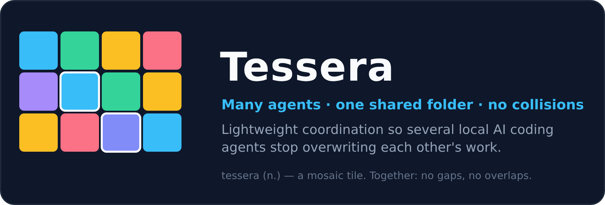
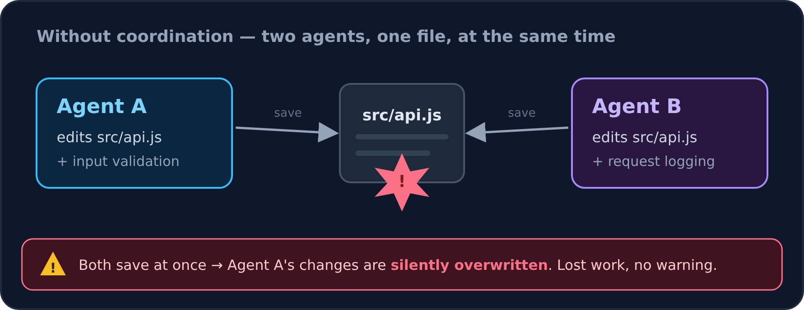
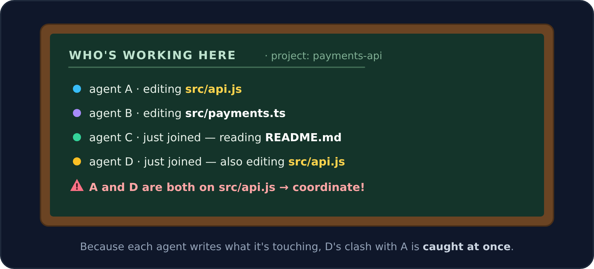
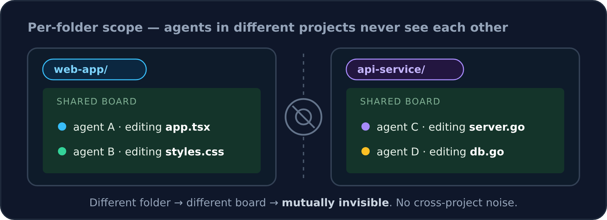
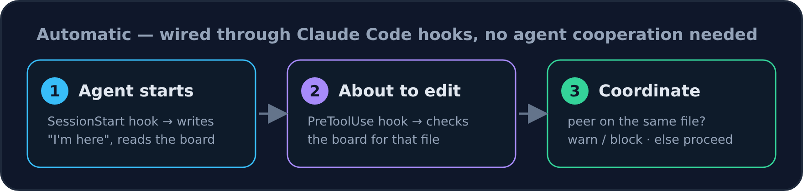

# Tessera

[English](README.md) · [Italiano](README.it.md) · **Español** · [Français](README.fr.md) · [Deutsch](README.de.md) · [Português](README.pt.md) · [简体中文](README.zh-Hans.md) · [日本語](README.ja.md)

<p align="center"></p>

Tessera te permite ejecutar **varios agentes de programación con IA locales en la misma carpeta a la vez** sin que se sobrescriban en silencio el trabajo unos a otros. Es diminuto (cero dependencias), funciona en cualquier proyecto y no necesita ningún servicio en segundo plano: la coordinación viaja sobre un archivo compartido más los hooks de [Claude Code](https://docs.claude.com/en/docs/claude-code).

> **Una skill que instalas una vez y luego olvidas.** Tessera se conecta a Claude Code como skill + hooks. En un proyecto que no la usa, es una comprobación de shell de ~milisegundos que no hace nada; en uno que sí la usa, no añade ningún trabajo en el que tus agentes tengan que pensar — ni siquiera necesitan saber que está ahí.

> **El nombre.** Una *tessera* es una sola pieza de un mosaico. En una *teselación*, las piezas cubren una superficie **sin huecos y sin solapamientos** — exactamente lo que quieres de muchos agentes compartiendo una misma base de código.

---

## El problema

Arranca dos o tres agentes en el mismo repositorio y te topas, en este orden, con:

1. **Sobrescritura silenciosa.** Dos agentes editan el mismo archivo en el mismo instante. El segundo guardado gana; el trabajo del primer agente desaparece — sin ningún error.
2. **Falta de conciencia.** No puedes ver quién está tocando qué. Te enteras de la colisión más tarde — en un conflicto de fusión o en una compilación rota.
3. **Lanzamientos impredecibles.** Los agentes se lanzan de forma improvisada (por ti, o por otros agentes). Nada avisa a los agentes que ya están trabajando de que acaba de llegar uno nuevo.
4. **Las herramientas existentes lo esquivan.** La mayoría de los ejecutores multiagente le dan a cada agente su propio *git worktree* y dejan que `git merge` lo resuelva después. Estupendo para trabajo totalmente independiente — pero no ayuda cuando los agentes deben colaborar **en un único checkout compartido**.



<p align="center"><sub><i>Dos agentes guardan <code>src/api.js</code> en el mismo instante — el segundo guardado gana, el trabajo del primer agente se pierde, y nada te avisa.</i></sub></p>

---

## La idea: un tablón compartido

Imagina un equipo trabajando en una sola sala. En la pared cuelga un tablón. Cada vez que alguien empieza una tarea la anota — *"Estoy con `api.js`"* — y todos echan un vistazo al tablón antes de coger un archivo.

**Tessera es ese tablón para tus agentes.** Vive *dentro* del proyecto (`<project>/.tessera/`) como un simple registro de solo añadido. Cada agente se anuncia y apunta lo que está editando; todos los demás agentes lo leen en tiempo real. Cuando dos van a por el mismo archivo, el que está a punto de escribir recibe un aviso.



<p align="center"><sub><i>Cada agente publica lo que está editando. Cuando el recién llegado D va a por el archivo de A, el tablón muestra el choque al instante — así se coordinan en lugar de colisionar.</i></sub></p>

Ningún agente tiene que *saber de* Tessera ni cooperar a propósito — todo está cableado a través de los hooks de Claude Code (ver **Cómo funciona**, más abajo).

---

## Alcance por carpeta — sin ruido entre proyectos

El tablón vive *dentro* del proyecto, así que solo conecta a los agentes que realmente comparten ese proyecto. Dos agentes en dos repositorios distintos escriben en dos tablones distintos y son **mutuamente invisibles**. Los subproyectos de un monorepo también permanecen independientes.



<p align="center"><sub><i>Dos proyectos, dos tablones. Los agentes en carpetas distintas no comparten nada y nunca se ven entre sí — sin ruido, sin falsas alarmas.</i></sub></p>

Un *scope* es la carpeta más cercana hacia arriba en el árbol que lleve un marcador (`.git`, `package.json`, `go.mod`, `pyproject.toml`, `Cargo.toml`, …, o un `.tessera-scope` explícito). Los agentes se coordinan solo donde las rutas que tocan caen en el **mismo** scope.

---

## Cómo funciona (bajo el capó)

Tessera es deliberadamente pequeño. Se apoya en una observación: **los conflictos vienen en tres tipos, y dos de ellos ya tienen herramientas excelentes.**

| Tipo de archivo | La herramienta adecuada | El trabajo de Tessera |
|---|---|---|
| **Archivos rastreados** (en git) | aislamiento con `git worktree` + un `git merge` real | **adoptarlo** — `tessera up --isolated` le da a cada agente su propio worktree + rama |
| **Conciencia** (quién está aquí, qué tocan) | *no existía nada ligero* | **construirlo** — el tablón compartido (el modo por defecto) |
| **Archivos compartidos que git no puede fusionar** (env ignorado por git, singletons generados) | un `flock` + escritura atómica | **planificado** (modo flock opcional), no en esta versión |

Así que Tessera construye solo la fina pieza que falta — la *conciencia* — y reutiliza `git`, `flock`, `inotify` (vía el `fs.watch` de Node), `tmux` y NDJSON para el resto. **No hay relojes vectoriales** (en una sola máquina un único archivo de solo añadido ya es un orden total), **ni daemon**, y **ningún coste en reposo**.



<p align="center"><sub><i>Todo el bucle es automático: anunciarse al arrancar, consultar el tablón antes de editar, coordinarse ante un choque — todo impulsado por hooks, invisible para el agente.</i></sub></p>

Algunos detalles para los curiosos:

- **El tablón es la fuente de verdad.** NDJSON de solo añadido; una escritura cortada se autorrepara (cada registro va enmarcado con un salto de línea inicial), y el lector está deduplicado y a prueba de contaminación de prototipos. `fs.watch` es solo un *timbre* — los agentes siempre reconcilian contra el registro.
- **Identidad = la sesión.** Una ejecución de `claude` aparte es un agente; sus propios sub-agentes son esa única unidad de trabajo (Claude ya separa sus archivos). La vitalidad es un latido más, cuando se conoce, `/proc`.
- **La verja es un hook.** `PreToolUse` puede advertir — o bloquear de forma dura bajo `TESSERA_GUARD=1` — *antes* de que una escritura llegue, enteramente en espacio de usuario (sin privilegios, sin `fanotify`).

📖 **Profundizando:** todo el razonamiento detrás de cada decisión — qué probamos y descartamos, y por qué se mantiene rápido y ligero — está en **[docs/RATIONALE.md](docs/RATIONALE.md)**.

---

## Instalación

```bash
git clone <repo-url> tessera && cd tessera
node bin/tessera.mjs install --global      # add the hooks to ~/.claude/settings.json (auto-backed-up); fires everywhere
# dormant (~ms shell pre-filter) in every project until one opts in:
node bin/tessera.mjs install --scope .      # opt THIS project in (creates .tessera/, gitignores it)
node bin/tessera.mjs install --uninstall    # remove the hooks (the skill dir and per-scope .tessera/ are left in place)
```

**Requisitos:** Linux, **node ≥18**, la CLI de [Claude Code](https://docs.claude.com/en/docs/claude-code), y `git`; `tmux` es opcional (sin él, el lanzador recurre a un spawn desacoplado). Para usar `tessera` directamente, ejecuta `npm link` (o `npm install -g .`) en el repositorio, o crea un enlace simbólico de `bin/tessera.mjs` en tu `PATH`. **No hay dependencias de npm** que instalar.

## Uso

```bash
tessera up --task "split the API module" -n 3      # 3 agents, SHARED checkout: awareness board + overlap warnings
tessera up --task "migrate to v2" -n 5 --isolated   # 5 agents, each in its own git worktree + branch
tessera up --task "..." -n 3 --dry-run              # preview the predicted collisions, don't launch
tessera ps --follow                                 # live dashboard: who's active, what they touch, overlaps
tessera ps --all                                    # every participating scope under the current folder
tessera kill wave1.2                                # safe teardown (tmux window / process group)
tessera doctor                                      # health check
```

## Lo que obtienes automáticamente

Una vez instalado, cada agente — sin importar cómo se lance — participa sin esfuerzo adicional:

- **Al arrancar** → se anuncia y se le informa *"hay N otros agentes activos aquí, tocando X, Y."*
- **Antes de cada edición** (`Edit` / `Write` / `NotebookEdit`) → registra lo que está tocando; si un par vivo está en el **mismo archivo**, recibe un aviso de coordinación (o un bloqueo duro bajo `TESSERA_GUARD=1`).
- **Al parar / finalizar** → latido y liberación.

## Garantías y límites

Un único host Linux, un solo usuario, sistema de archivos local (los bloqueos consultivos e inotify no son fiables en NFS). Tessera defiende la **integridad de los datos** y la **correcta selección del objetivo al desmontar**; **no** defiende contra un proceso malicioso del mismo usuario, ni protege los *valores* de los secretos — dicho con franqueza, sin fingir. Coordinar agentes entre *máquinas distintas* es una capa opcional planificada (un transporte de red sobre una VPN de malla); hoy el tablón local es toda la historia, a propósito. Ver [`docs/ROADMAP.md`](docs/ROADMAP.md) y [`docs/DESIGN.md`](docs/DESIGN.md).

## Trabajo relacionado

Los ejecutores que priorizan el aislamiento — **uzi**, **claude-squad**, **vibe-kanban**, **Conductor** — le dan a cada agente su propio worktree/espacio de trabajo y aplazan los conflictos a `git merge`; **claude-flow** coordina los sub-agentes que *él mismo* orquesta a través de un pesado blackboard SQLite compartido. Tessera es la fina capa de conciencia entre pares, de cero dependencias, para un *checkout compartido* — y como todas esas herramientas ejecutan Claude Code real, los hooks de Tessera también se disparan dentro de ellas, así que **se compone** con ellas en lugar de competir.

## Licencia

MIT. Las contribuciones son bienvenidas.
